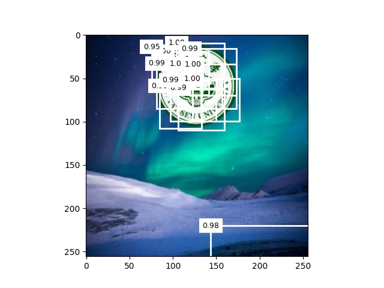
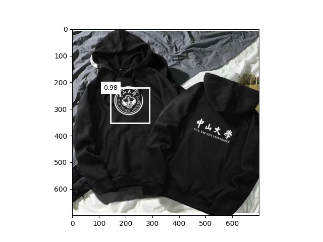

# TINYSSD

本储存库包含了人工智能原理实验的目标检测—SSD实验。

SSD算法，其英文全名是Single Shot MultiBox Detector。SSD相较于其他算法的改进有：1、SSD提取了不同尺度的特征图来做检测，大尺度特征图（较靠前的特征图）可以用来检测小物体，而小尺度特征图（较靠后的特征图）用来检测大物体；2、SSD采用了不同尺度和长宽比的先验框。


## Dataset

该数据集的图片为自动合成

- 待检测对象
- 背景图片
- 合成训练样本
- 准备测试样本 

### Structure of dataset folders

```
├─detection
  │  create_train.py
  │  
  ├─background
  │      000012-16347456122a06.jpg
  │	    ...
  │      191313-1519470793f344.jpg
  │      191328-15136820086f91.jpg
  │      
  ├─sysu_train
  │  │  label.csv
  │  │  
  │  └─images
  │          000012-16347456122a06.jpg
  │		...
  │          183201-15420187218258.jpg
  │          
  ├─target
  │      0.jpg
  │      0.png
  │      1.png
  │      2.png
  │      
  └─test
         1.jpg
         2.jpg
```

## Usage

### 1.Requirements

- numpy
- pandas
- matplotlib
- opencv-python
- torch
- torchvision

### 2.Install required packages

我使用的是 Pytorch 1.8.2 和 python 3.8.

```shell
pip install -r requirements.txt
```


## Files description

- [tinySSD.py](https://github.com/Notonion/TinySSD/blob/master/tinySSD.py)
  SSD模型
- [train.py](https://github.com/Notonion/TinySSD/blob/master/train.py)
  用于训练模型的代码
- [test.py](https://github.com/Notonion/TinySSD/blob/master/test.py)
  用于测试模型的代码
- [net_60.pkl](https://github.com/Notonion/TinySSD/blob/main/checkpoint/net_60.pkl)
  训练得到的最好的模型


## Recreation

#### Steps for training the model:

```shell
python train.py
```

#### Steps for evaluating the model:

```shell
python test.py
```


## Results





## Improvement

**1.将预测偏移量用到的L1范数损失替换为平滑L1范数损失。**

它在零点附近使用平方函数从而使损失函数更加平滑，它的原理是通过一个超参数σ来控制平滑区域：
$$
f(x)= \begin{cases}(\sigma x)^2 / 2, & \text { if }|x|<1 / \sigma^2 \\ |x|-0.5 / \sigma^2, & \text { otherwise }\end{cases}
$$
当σ非常大时，这种损失类似于L1范数损失。当它的值较小时，损失函数较平滑。

```python
def smooth_l1(x, sigma=1.0):
    sigma2 = sigma ** 2
    return torch.where(x.abs() < 1. / sigma2, 0.5 * x ** 2 * sigma2, x.abs() - 0.5 / sigma2)
```

**2.将交叉熵损失替换为焦点损失。**

焦点损失函数为：
$$
-\alpha\left(1-p_j\right)^\gamma \log p_j
$$
通过调节γ的值，使训练更集中在那些错误分类的困难示例上，从而提升效果。

```python
def focal_loss(gamma, x):
    return -(1 - x) ** gamma * torch.log(x)
```

